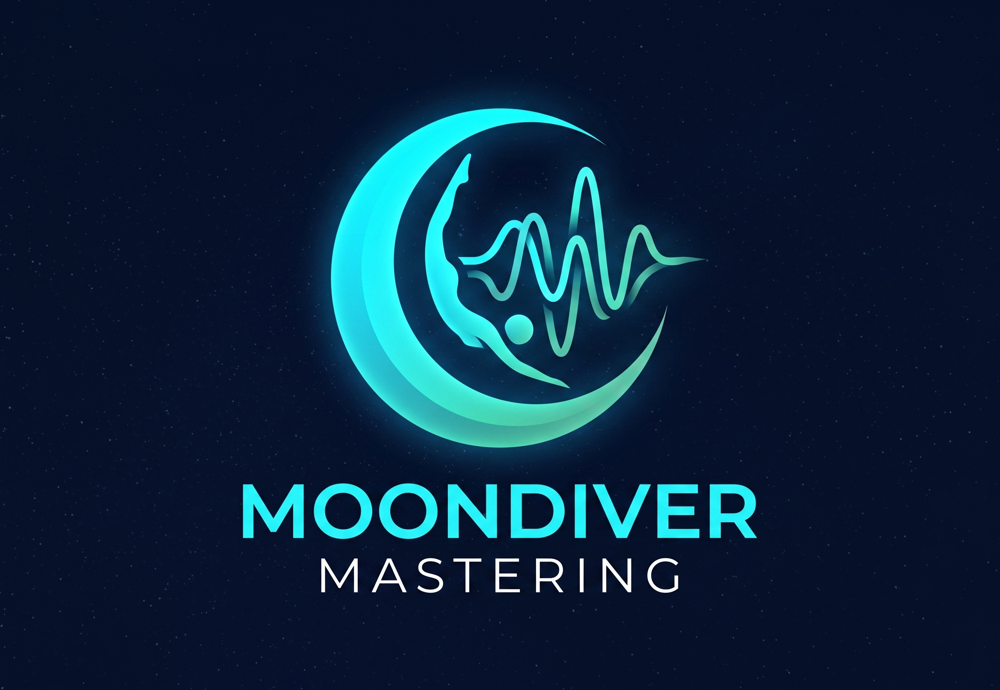

<p align="center">
  
</p>

# Moondiver Studio & Audio Mastering MCP Server

[](https://github.com/rmissal/moondiver-studio/actions/workflows/ci.yml)
[](https://opensource.org/licenses/Apache-2.0)

A professional, standalone audio mastering suite with a local web dashboard (`localhost:3000`) and native Model Context Protocol (MCP) integration for **Google Antigravity**.

Allows automated mastering of individual audio files or entire album project directories using tailored studio mastering profiles (New Age, Ambient, Instrumental, Cinematic, Rock, Pop, etc.), computing dramatic tension curves and track sequencing, AI-powered stem separation (Demucs) with automatic stem mixing, and artwork upscaling.

---

## 🚀 Installation & Quick Start

### 1. Prerequisites

Before installing Moondiver Studio, ensure you have the following system dependencies installed:

- **Node.js** (v18 or higher)
- **Python 3.10+** (Required for AI Demucs Stem Separation)
- **FFmpeg & FFprobe** (Required for Audio Mastering & Processing)
  - **Windows:** Download a static build from [Gyan.dev](https://www.gyan.dev/ffmpeg/builds/) or [BtbN](https://github.com/BtbN/FFmpeg-Builds/releases). Extract the .zip and place the fmpeg.exe and fprobe.exe files into the fmpeg/bin/ folder inside this repository.
  - **macOS/Linux:** Install globally via rew install ffmpeg or sudo apt install ffmpeg.

### 2. Clone & Setup

Moondiver Studio includes an automated bootstrap script (setup.js) that will install all Node.js modules, detect your Python environment, install CUDA-accelerated PyTorch (on Windows), and set up the Meta Demucs AI separation libraries.

`ash
git clone https://github.com/rmissal/moondiver-studio.git
cd moondiver-studio
node setup.js
`

### 3. Start the Web Dashboard

`ash
npm run ui
`

*(Or simply double click **start.bat** on Windows for a styled ANSI CLI terminal experience!)*

_Opens the Mastering Dashboard in your browser at http://localhost:3000._

### 4. Run Tests & Test Coverage

`ash
npm test
npm run test:coverage
`

---
## 🛠️ Included MCP Tools

The repository provides the following tools via the Model Context Protocol (MCP) for Antigravity and LLM assistants:

### 1. `master_audio`

Two-pass adaptive linear DSP mastering (Pass 1 loudness analysis + Pass 2 calibrated mastering with analog tape warmth, de-hiss, de-essing, stereo widening, anti-click micro fade-in, and reverb-tail fade-out). Exports 24-bit Lossless Studio WAV and 320 kbps MP3 files with stripped AI watermarks and embedded studio metadata tags.

### 2. `analyze_audio`

Measures technical and psychoacoustic values compliant with EBU R128 and Apple Digital Masters standards:

- EBU R128 Integrated Loudness (LUFS), True Peak (dBTP), Loudness Range (LRA), Crest Factor
- Automatic acoustic genre classification
- **Apple Music Quality & Compliance Score** (0–100% confidence rating)

### 3. `sequence_album`

Computes optimal album track sequences and dramatic tension arcs (`cinematic_journey`, `classic_3_act`, `meditation_descent`, `energy_wave`), renumbers audio files (`01 - ...`), generates M3U playlists (`album_wav.m3u`, `album_mp3.m3u`), and produces a detailed `TRACKLIST.md` with Mermaid energy diagrams.

### 4. `mix_stems`

AI-powered stem separation and fully automated stem mixing (Vocals, Bass, Drums, Other) with profile-based EQ, anti-bleed gating, and spatial acoustic balancing.

### 5. `upscale_cover_art`

AI/Lanczos-enhanced upscaling of album cover artwork to lossless high-resolution standards (up to 3000x3000 / 300 DPI).

### 6. `list_mastering_presets`

Returns all available mastering sound profiles and their DSP filter parameters.

---

## 🎛️ Mastering Profiles (Presets)

| Preset                       | Target LUFS |  True Peak  |    LRA    | Stereo Width | Characteristics                                                                            |
| :--------------------------- | :---------: | :---------: | :-------: | :----------: | :----------------------------------------------------------------------------------------- |
| **`auto`** _(Default)_       |  _Dynamic_  | `-1.5 dBTP` | _Dynamic_ |    _1.15_    | **Intelligent acoustic analysis in Pass 1** + dynamic profile selection                    |
| **
ew_age_ambient**        |   -16.0   | -1.5 dBTP |  15.0   |    1.15    | Open, smooth, silky treble sheen, wide panorama for pads, flutes & piano                   |
| **chillout_balearic**      |   -15.0   | -1.5 dBTP |  14.0   |    1.15    | Warm analog saturation, crisp snares, deep sub-bass, and immersive pad spacing             |
| **
u_jazz**                |   -16.0   | -1.5 dBTP |  15.0   |    1.08    | Clean, intimate, preserving transients of acoustic drums and upright bass without crushing |
| **coustic_jazz**          |   -16.0   | -1.5 dBTP |  16.0   |    1.05    | Organic and untreated. True to live room acoustics, maximizing natural breathing space     |
| **melodic_dance**          |   -14.0   | -1.5 dBTP |  10.0   |    1.10    | Punchy 4/4 kicks, thick sub-bass, bright synth leads, tight low-end compression            |
| **cinematic_orchestral**   |   -15.0   | -1.5 dBTP |  18.0   |    1.10    | Enormous dynamic range for orchestral swells, strings & soundtracks with powerful sub bass |

| **`acoustic_instrumental`**  |   `-16.0`   | `-1.5 dBTP` |  `14.0`   |    `1.06`    | Clean, organic timbre for acoustic guitars, harp & solo instruments without harshness      |
| **`meditation_chillout`**    |   `-18.0`   | `-1.5 dBTP` |  `16.0`   |    `1.20`    | Gentle, transparent, minimal compression, maximal spherical immersion                      |
| **`streaming_pop_standard`** |   `-14.0`   | `-1.0 dBTP` |  `10.0`   |    `1.00`    | Punchy and assertive impact adhering to modern streaming radio standards                   |
| **`stadium_live_rock`**      |   `-15.0`   | `-1.5 dBTP` |  `15.0`   |    `1.25`    | Massive live stage, biting guitars, snappy drums and airy high-end atmosphere              |
| **`custom`**                 |  _Custom_   |  _Custom_   | _Custom_  |   _Custom_   | Full manual control of all filters, frequencies, and gain parameters                       |

---

## 🧪 Testing & Continuous Integration

This project adheres to strict **Agentic Coding Standards** and includes an automated test harness:

- **Test Runner:** [Vitest](https://vitest.dev/)
- **Coverage Engine:** V8 with automated Markdown publishing to the GitHub Step Summary
- **CI Pipeline:** GitHub Actions (`.github/workflows/ci.yml`) on every push and pull request

```bash
# Run test suite
npm test

# Run tests with V8 coverage report
npm run test:coverage
```

---

## ⚙️ Antigravity & MCP Configuration

Add to `~/.gemini/config/mcp_config.json`:

```json
{
  "mcpServers": {
    "audio-mastering": {
      "command": "node",
      "args": ["E:/workspaces/Moondiver-Studio/index.js"]
    }
  }
}
```

---

## 📄 License

This project is licensed under the **Apache License 2.0** – see the [LICENSE](LICENSE) file for details.
